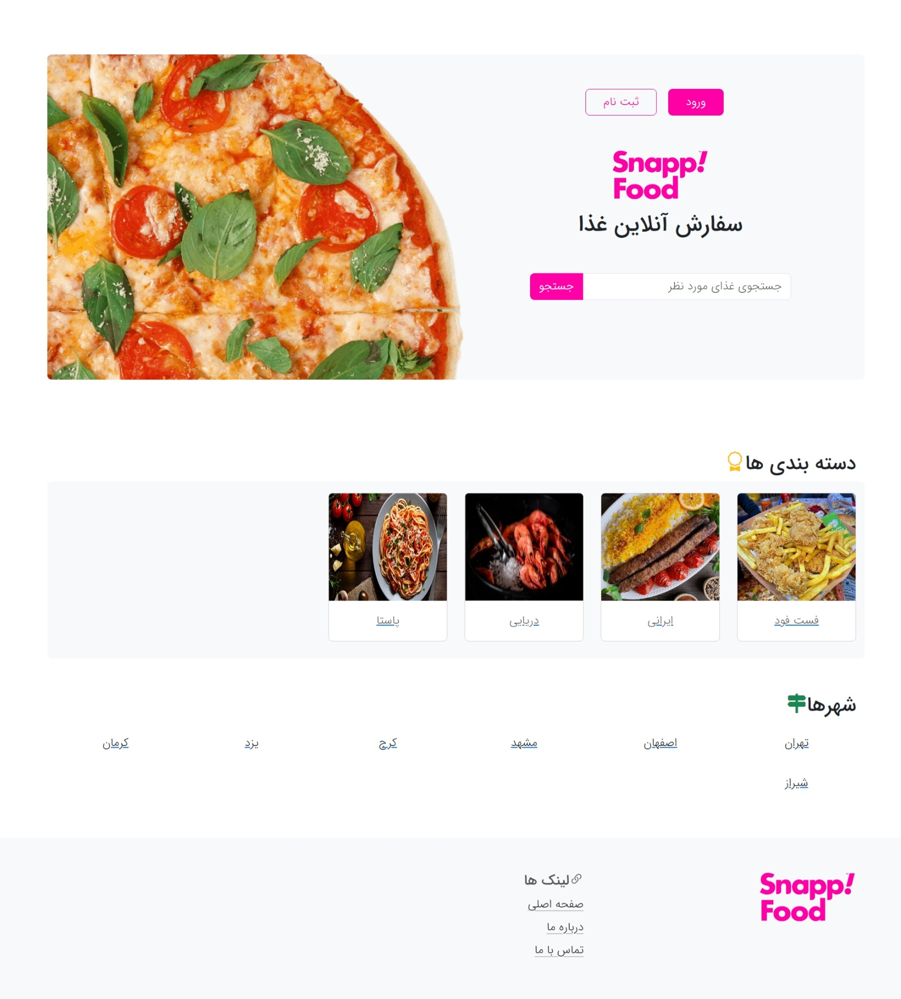
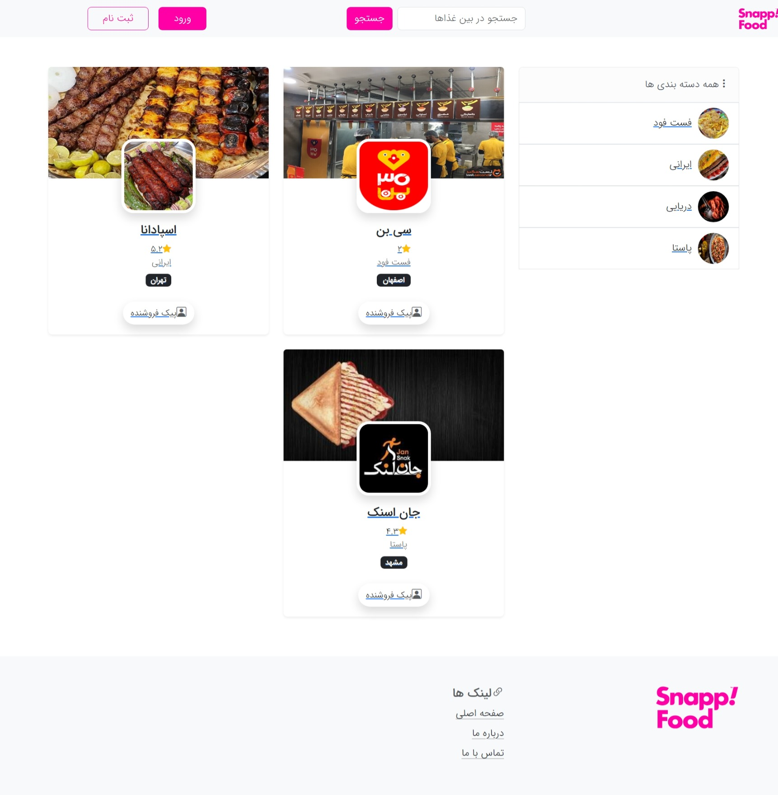
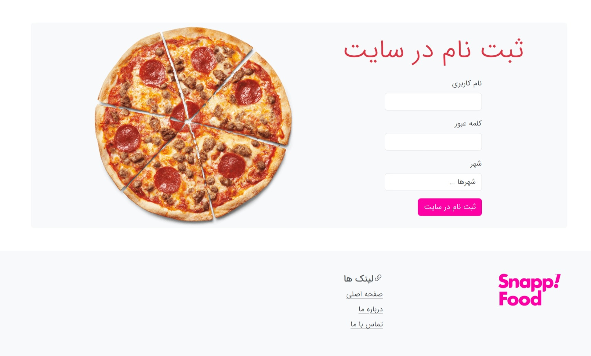

# SnappFood

### Snapp Food with `Django Rest Framework` and `React.js`

- Backend with **`Django Rest Framework`**
- Frontend with **`React.js`**

### **`Developer: Mohammad Sadra Borumand`**

---

## `Run Project`

first should be run backend `django rest framework` run command in terminal

`install packages`
```
pip install -r requirements.txt
```
`run django rest framework`
```
python manage.py runserve
```

---

next run fronend `react.js` run command in terminal

`install packages`
```
npm install
or
yarn install
or
pnpm install
```

`run react.js app`
```
npm run dev
```

## Demo





## Project Structure

`Template folder`

```
📦template
 ┣ 📂assets
 ┃ ┣ 📂css
 ┃ ┃ ┣ 📂fonts
 ┃ ┃ ┃ ┣ 📜bootstrap-icons.woff
 ┃ ┃ ┃ ┗ 📜bootstrap-icons.woff2
 ┃ ┃ ┣ 📜bootstrap-icons.css
 ┃ ┃ ┣ 📜bootstrap.rtl.min.css
 ┃ ┃ ┣ 📜bootstrap.rtl.min.css.map
 ┃ ┃ ┗ 📜styles.css
 ┃ ┣ 📂fonts
 ┃ ┃ ┣ 📂eot
 ┃ ┃ ┃ ┣ 📜IRANSansWeb.eot
 ┃ ┃ ┃ ┣ 📜IRANSansWeb_Black.eot
 ┃ ┃ ┃ ┣ 📜IRANSansWeb_Bold.eot
 ┃ ┃ ┃ ┣ 📜IRANSansWeb_Light.eot
 ┃ ┃ ┃ ┣ 📜IRANSansWeb_Medium.eot
 ┃ ┃ ┃ ┗ 📜IRANSansWeb_UltraLight.eot
 ┃ ┃ ┣ 📂ttf
 ┃ ┃ ┃ ┣ 📜IRANSansWeb.ttf
 ┃ ┃ ┃ ┣ 📜IRANSansWeb_Black.ttf
 ┃ ┃ ┃ ┣ 📜IRANSansWeb_Bold.ttf
 ┃ ┃ ┃ ┣ 📜IRANSansWeb_Light.ttf
 ┃ ┃ ┃ ┣ 📜IRANSansWeb_Medium.ttf
 ┃ ┃ ┃ ┗ 📜IRANSansWeb_UltraLight.ttf
 ┃ ┃ ┣ 📂woff
 ┃ ┃ ┃ ┣ 📜IRANSansWeb.woff
 ┃ ┃ ┃ ┣ 📜IRANSansWeb_Black.woff
 ┃ ┃ ┃ ┣ 📜IRANSansWeb_Bold.woff
 ┃ ┃ ┃ ┣ 📜IRANSansWeb_Light.woff
 ┃ ┃ ┃ ┣ 📜IRANSansWeb_Medium.woff
 ┃ ┃ ┃ ┗ 📜IRANSansWeb_UltraLight.woff
 ┃ ┃ ┗ 📂woff2
 ┃ ┃ ┃ ┣ 📜IRANSansWeb.woff2
 ┃ ┃ ┃ ┣ 📜IRANSansWeb_Black.woff2
 ┃ ┃ ┃ ┣ 📜IRANSansWeb_Bold.woff2
 ┃ ┃ ┃ ┣ 📜IRANSansWeb_Light.woff2
 ┃ ┃ ┃ ┣ 📜IRANSansWeb_Medium.woff2
 ┃ ┃ ┃ ┗ 📜IRANSansWeb_UltraLight.woff2
 ┃ ┣ 📂images
 ┃ ┃ ┣ 📜63cea3181886c.jpg
 ┃ ┃ ┣ 📜desktop_1_603508bf202d8_img_st_food.png
 ┃ ┃ ┣ 📜hero-image.png
 ┃ ┃ ┣ 📜kebab.png
 ┃ ┃ ┣ 📜logoChBa.jpg
 ┃ ┃ ┣ 📜p1.png
 ┃ ┃ ┗ 📜website_image_irani_1.jpg
 ┃ ┗ 📂js
 ┃ ┃ ┣ 📜bootstrap.min.js
 ┃ ┃ ┗ 📜bootstrap.min.js.map
 ┣ 📜index.html
 ┣ 📜login.html
 ┣ 📜main.html
 ┗ 📜main2.html
```

`snapp_backend` folder
```
📦snapp_backend
 ┣ 📦snappApi
 ┣ 📂migrations
 
 ┣ 📜admin.py
 ┣ 📜apps.py
 ┣ 📜models.py
 ┣ 📜serializers.py
 ┣ 📜tests.py
 ┣ 📜urls.py
 ┣ 📜views.py
 ┗ 📜__init__.py

┃ ┣ 📜asgi.py
┃ ┣ 📜settings.py
┃ ┣ 📜urls.py
┃ ┣ 📜wsgi.py
┃ ┗ 📜__init__.py
```

`snapp_fronend` folders
```
📦src
 ┣ 📂components
 ┃ ┣ 📜authForm.js
 ┃ ┣ 📜categories.js
 ┃ ┣ 📜category.js
 ┃ ┣ 📜cities.js
 ┃ ┣ 📜city.js
 ┃ ┣ 📜foodItem.js
 ┃ ┣ 📜footer.js
 ┃ ┣ 📜headerHome.js
 ┃ ┣ 📜navbar.js
 ┃ ┗ 📜shopItem.js
 ┣ 📂layouts
 ┃ ┗ 📜layout.js
 ┣ 📂pages
 ┃ ┣ 📜about.js
 ┃ ┣ 📜contact.js
 ┃ ┣ 📜home.js
 ┃ ┣ 📜login.js
 ┃ ┣ 📜NoPage.js
 ┃ ┣ 📜register.js
 ┃ ┣ 📜search.js
 ┃ ┣ 📜shopFoods.js
 ┃ ┗ 📜shops.js
 ┣ 📂utils
 ┃ ┗ 📜api.js
 ┣ 📜App.js
 ┣ 📜App.test.js
 ┣ 📜index.js
 ┣ 📜logo.svg
 ┣ 📜reportWebVitals.js
 ┣ 📜routesConfig.js
 ┗ 📜setupTests.js
```

`template` folders

```
📦template
 ┣ 📂assets
 ┃ ┣ 📂css
 ┃ ┃ ┣ 📂fonts
 ┃ ┃ ┃ ┣ 📜bootstrap-icons.woff
 ┃ ┃ ┃ ┗ 📜bootstrap-icons.woff2
 ┃ ┃ ┣ 📜bootstrap-icons.css
 ┃ ┃ ┣ 📜bootstrap.rtl.min.css
 ┃ ┃ ┣ 📜bootstrap.rtl.min.css.map
 ┃ ┃ ┗ 📜styles.css
 ┃ ┣ 📂fonts
 
  📜desktop_1_603508bf202d8_img_st_food.png
 ┃ ┃ ┣ 📜hero-image.png
 ┃ ┃ ┣ 📜kebab.png
 ┃ ┃ ┣ 📜logoChBa.jpg
 ┃ ┃ ┣ 📜p1.png
 ┃ ┃ ┗ 📜website_image_irani_1.jpg
 ┃ ┗ 📂js
 ┃ ┃ ┣ 📜bootstrap.min.js
 ┃ ┃ ┗ 📜bootstrap.min.js.map
 ┣ 📜index.html
 ┣ 📜login.html
 ┣ 📜main.html
 ┗ 📜main2.html
```